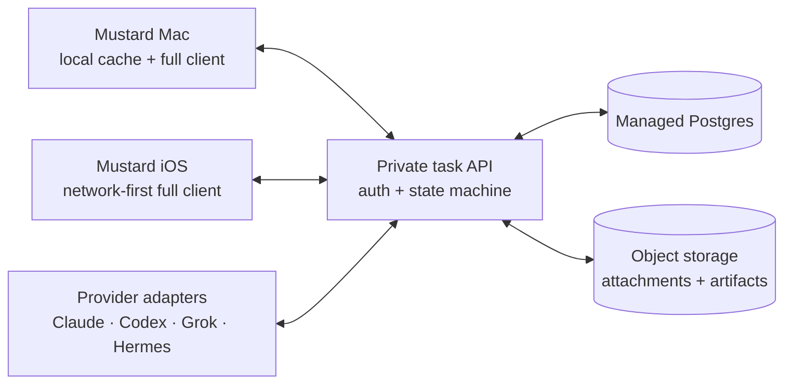

# Mustard shared task service and multi-agent clients — Claude handoff

**Status date:** 2026-08-26
**Audience:** Claude/Codex design or implementation session continuing the Mustard architecture discussion
**Handoff type:** Product and architecture direction; implementation is not yet authorised
**Current branch:** `main`
**Current HEAD:** `32fa437` (`perf(voice): stop losing the first words of a dictation, and measure the rest (#149)`)
**Worktree:** `/Users/leoncreed-baker/Documents/Cavehole/Mustard`

## Read this first

Read the current project guide and architecture before making any proposal or edit:

- `CLAUDE.md`
- `docs/architecture.md`
- `docs/adr/0001-swiftdata-cloudkit-not-server.md`
- `docs/adr/0003-agent-via-claude-subscription.md`
- `docs/adr/0010-decoupled-agent-execution-via-board-queue.md`
- `docs/handoffs/2026-07-13-agent-task-sessions-claude-handoff.md`
- `docs/specs/2026-07-13-agent-task-sessions-design.md`

The checkout was clean when this handoff was written. Do not work directly on `main`
for implementation. Create an isolated branch or worktree if Leon later approves the
design and plan.

## Executive summary

Mustard currently stores structured tasks in device-local SwiftData. The Mac can run
the local Claude worker, and the connected-worker file bridge is an explicit fallback,
but another AI service cannot reliably create, claim, execute, question, update, or
complete a task because there is no shared network-accessible task service.

The agreed direction is a private, single-user, hosted task control plane backed by a
proper database. Mustard on Mac and iOS become clients of that service. Claude, Codex,
Grok, Hermes Agent, and future providers become worker adapters using one
provider-neutral task contract.

This is not simply “move the SwiftData file to the cloud.” It is a shared execution
system with task state, durable conversations, leases, artifacts, provider selection,
and an audit trail.

## Product decisions agreed in conversation

These are the current working decisions from Leon’s 26 August discussion:

- **Scope:** private and single-user for now. Do not build teams, billing, or complex
  multi-user permissions in the first slice, but use stable IDs and boundaries that do
  not make future multi-user support a rewrite.
- **Backend:** use a small private hosted backend with managed Postgres and an
  authenticated API. The exact vendor and framework are still open.
- **Shared authority:** the backend is authoritative for shared task and agent-run
  state. Local SwiftData may remain as a fast Mac cache and app workspace.
- **Execution context:** workers may access whatever task context they need, including
  notes, links, full agent conversations, attachments, generated artifacts, meeting
  transcripts, and audio where relevant.
- **Credentials:** do not put provider tokens or raw credentials in task payloads.
  Store integrations separately and expose only scoped references/capabilities to a
  worker.
- **iOS:** build a full Mustard client, not a review-only companion. It should support
  task creation, editing, delegation, approvals, agent questions, take-back, review,
  attachments, and notifications.
- **iOS connectivity:** iOS is network-first. It does not need offline task creation
  or editing. A last-read cache is optional for responsiveness, but stale data must be
  visible and mutations require a connection.
- **Provider choice:** Leon selects the provider when delegating. Initial provider
  choices may include Claude, Codex, Grok, Hermes Agent, or manual/unassigned.
- **Provider contract:** keep task and conversation data provider-neutral. Provider
  session IDs, model names, capabilities, and transport details belong in the adapter
  layer.
- **Unavailable provider:** do not silently reroute. If the selected provider is
  unavailable, leave the task queued with a clear reason and allow reassignment.
- **Existing safety rules remain:** agent work still needs durable history and review;
  questions go to Needs You; external email/message/ticket actions remain gated and
  drafts-only unless Leon explicitly changes that policy.

## Current Mustard baseline

The existing implementation is intentionally local-first/local-only in important
areas:

- Native SwiftUI and SwiftData models in `MustardKit`.
- `MustardTask`, `AgentRun`, and ordered `AgentMessage` models already represent tasks
  and resumable agent conversations.
- `AgentTaskCoordinator` owns the local execution lifecycle and currently runs the
  Claude CLI on the Mac.
- The file bridge is reserved for explicit `requiresConnectedWorker` work; ordinary
  local tasks are not exported.
- `MustardMobile` already exists as a separate iOS target sharing `MustardKit`, but its
  current data path is local and CloudKit is not wired.
- `CLAUDE.md` and ADR-0001 currently say SwiftData + future CloudKit, with no hosted
  backend. The new direction therefore requires a formal ADR supersession or update;
  do not silently edit that decision while implementing a prototype.

Preserve the existing state-machine semantics and review gates unless the new design
explicitly proposes a replacement.

## Target architecture



The first version does not need a complex event bus. A transactional API, database
leases, cursor-based task events, and push notifications for user attention are enough
to establish the shared control plane. Worker polling can be used until a stronger
delivery mechanism is justified.

### Responsibilities

**Private API**

- Authenticate Leon and registered workers.
- Enforce task state transitions and review gates.
- Provide idempotent task creation and mutations.
- Issue worker leases and reject stale claims.
- Store provider selection and execution metadata.
- Append durable messages/events rather than overwriting history.
- Return scoped artifact and integration access.

**Managed Postgres**

- Stores task metadata, relationships, state, revisions, agent runs, messages, leases,
  provider assignments, and an append-only audit/event record.

**Object storage**

- Stores large attachments, audio, transcripts, and generated files.
- Access is through short-lived, task-scoped URLs or equivalent capabilities.

**Mustard Mac**

- Remains the primary rich desktop client.
- May cache data locally for speed and retain local app/UI state.
- Syncs task and agent-run changes with the backend.
- Does not become a second competing authority for shared execution state.

**Mustard iOS**

- Uses the same API and task contract.
- Requires connectivity for task mutations.
- Provides full task and agent workflow parity.
- Does not depend on a long-running local worker or iOS background execution.

**Workers**

- Claim a task only when its selected provider matches their adapter identity/capability.
- Fetch the complete authorised execution context.
- Heartbeat the lease while working.
- Append progress, questions, results, and artifact references through the API.
- Never silently change providers or bypass review/gating policy.

## Proposed domain model

Use this as a starting point for the formal schema; validate it against the existing
SwiftData models before implementation:

| Entity | Purpose |
|---|---|
| `Task` | User-owned task, title, notes, links, stage, owner, priority, schedule, dependencies, selected provider, revision, and timestamps |
| `TaskContext` | Structured references and permissions describing what a worker may read/use for this task |
| `AgentRun` | One delegated execution attempt/conversation, provider identity, model, provider session ID, state, retry data, and lease state |
| `AgentMessage` | Ordered immutable conversation/progress/question/result messages |
| `Artifact` | Attachment or generated output stored in object storage with metadata and task/run linkage |
| `TaskEvent` | Append-only audit and sync cursor: creation, assignment, claim, progress, question, reply, review, take-back, failure, and completion |
| `Worker` | Registered provider adapter, capabilities, health, and allowed scopes |
| `WorkerLease` | Claim owner, expiry, heartbeat, and idempotency information |
| `IntegrationRef` | Non-secret reference to a separately stored provider/tool integration |

Keep credentials and refresh tokens outside the task database or task context. A task
may refer to an allowed integration, but the worker receives only the minimum scoped
capability needed for the action.

## Minimum API surface to design

The formal design should define exact request/response schemas, authentication, error
codes, idempotency, revision handling, and transition rules for at least:

- Create and list tasks.
- Read a task with its context, run, messages, and artifact metadata.
- Edit task fields with optimistic concurrency.
- Select or change the provider assignment.
- Claim a task, renew a lease, release a lease, and report worker health.
- Append messages, progress events, questions, replies, failures, and results.
- Upload, download, and attach artifacts.
- Approve, reject, request changes, take back, cancel, and retry.
- Consume task events from a cursor for Mac/iOS synchronization.

Use idempotency keys for task creation and outward actions. A timeout during an
external creation must remain completion-uncertain and go to review; it must not be
blindly retried into a duplicate action.

## Required lifecycle semantics

Preserve the current Mustard intent while mapping it to server state:

```text
Inbox/Planned
  → delegated with selected provider
  → Queued
  → Claimed/In Progress
  → Needs You (question) ──reply──▶ Queued/In Progress
  → Needs Review
  → Accepted / Take Back / Request Changes
```

The design must also cover:

- Lease expiry and worker crash recovery.
- Provider authentication failure without consuming the task.
- Selected-provider outage without silent fallback.
- Reassignment to another provider without losing the original run history.
- Cancellation and take-back racing with a late worker result.
- Offline/stale Mac cache writes versus newer server revisions.
- Notification delivery for Needs You and Needs Review.
- Retention and deletion for audio, transcripts, attachments, and artifacts.

## Recommended work sequence

This is a design/implementation sequence, not permission to start coding:

1. **Architecture and ADR review.** Confirm the hosted-backend direction, identify how
   it supersedes ADR-0001, and record what remains local.
2. **Formal schema and task contract.** Map the existing SwiftData models and state
   transitions to the proposed server entities without losing `AgentRun` history,
   review gates, or idempotency semantics.
3. **API and auth design.** Define the single-user auth model, worker registration,
   leases, revisions, event cursors, artifact access, and integration references.
4. **Small vertical slice.** Create a task through the API, explicitly assign a
   provider, have a worker claim it, append a question/result, and return it to Needs
   Review. Keep the existing local path working until the slice is verified.
5. **Worker adapters.** Start with the currently proven Claude path, then add Codex and
   other providers only after their transport/auth/capabilities are verified. Do not
   assume Grok or Hermes integration details.
6. **Mac migration.** Replace the shared execution authority gradually: API-backed
   task/run state first, local cache second, with a reversible migration for existing
   SwiftData tasks.
7. **iOS full client.** Build the network-first iOS client against the stable API:
   full board, task detail, delegation, questions, review, attachments, and push
   notifications.
8. **Data migration and hardening.** Migrate local tasks/runs with stable IDs, verify
   duplicate safety and conflict behavior, test provider outages, and document
   recovery/rollback.

## Guardrails for the continuing Claude session

- Do not edit or supersede ADR-0001 silently; present the proposed replacement for
  Leon’s approval.
- Do not choose Supabase, Node, CloudKit, or another vendor merely because it is
  familiar. Compare the options against the single-user/private/API/worker goals.
- Do not expose the raw SwiftData store or filesystem as the public integration
  interface.
- Do not make provider-specific fields the core task schema.
- Do not add automatic fallback routing without an explicit product decision.
- Do not remove the current human review and always-gated outward-action rules.
- Do not start backend, billing, team, or multi-user work in the first slice.
- Do not claim a provider integration is viable until its current auth and execution
  path has been verified.
- Keep implementation work on an isolated branch/worktree. Follow TDD for pure state,
  transition, lease, and protocol logic; run `swift test`, `swift build`, and
  `./build-ios.sh` when shared code changes.
- Preserve unrelated worktree changes and do not merge or push without the normal
  review gates.

## Definition of a good next handoff

The next Claude session should return:

1. A short comparison of 2–3 backend approaches, with a recommendation.
2. A formal architecture/design document covering schema, API, auth, sync, workers,
   artifacts, security, migration, and rollback.
3. An explicit list of changes required to supersede ADR-0001 and any affected ADRs.
4. A staged implementation plan with a small vertical slice and verification criteria.
5. Open decisions that genuinely require Leon’s input, without blocking on avoidable
   questions.

Do not write production code until Leon has reviewed and approved the formal design and
implementation plan.

## Copy/paste prompt for Claude

> Read `CLAUDE.md`, `docs/architecture.md`, the relevant ADRs, and
> `docs/handoffs/2026-08-26-shared-task-service-and-multi-agent-clients.md`.
>
> Continue the Mustard architecture work from this handoff. The agreed direction is a
> private single-user managed-Postgres task control plane with an authenticated API,
> object storage for large context/artifacts, a local Mac cache, a network-first full
> iOS client, and explicit provider selection for Claude/Codex/Grok/Hermes/manual.
> Workers must use a provider-neutral task contract, leases, durable messages, and
> review gates. No silent provider fallback. Existing local SwiftData/Claude/file-
> bridge behavior is the baseline, and ADR-0001 currently conflicts with this new
> direction.
>
> Do a read-only architecture pass first. Compare 2–3 backend approaches, map the
> existing SwiftData/AgentRun lifecycle to a proposed server schema and API, identify
> migration and security risks, and write a formal design/spec plus staged plan only
> after the direction is clear. Do not modify production code, select a vendor by
> assumption, edit ADR-0001 silently, or commit to `main`. Return the recommendation,
> the design path, unresolved decisions, and the exact files that would need approval
> before implementation.
